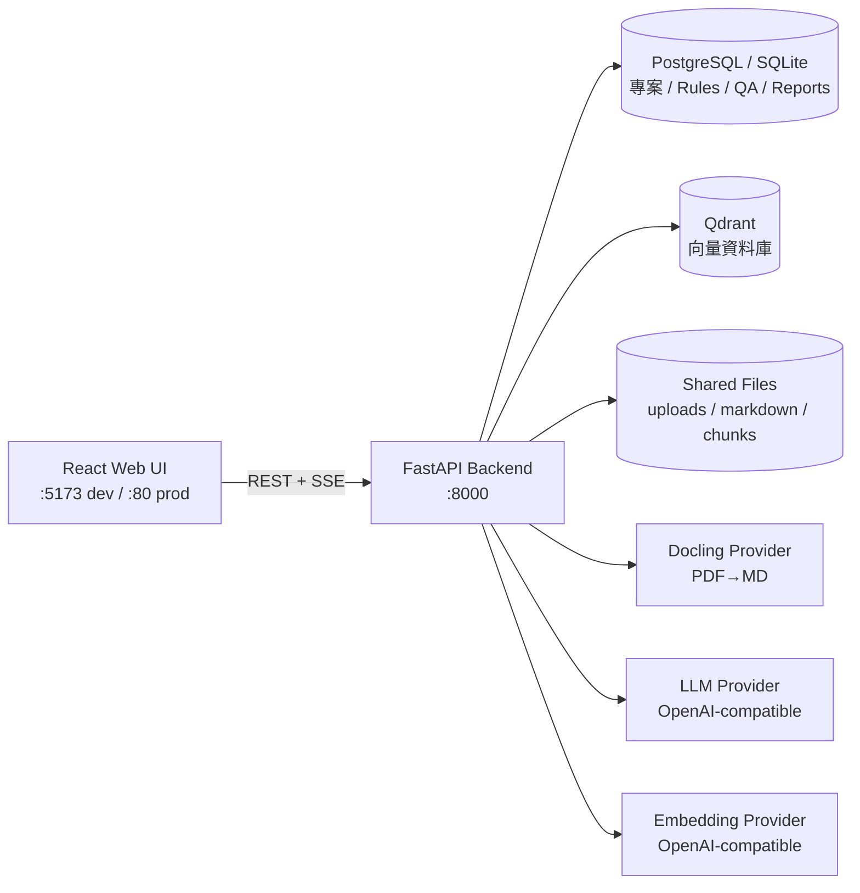
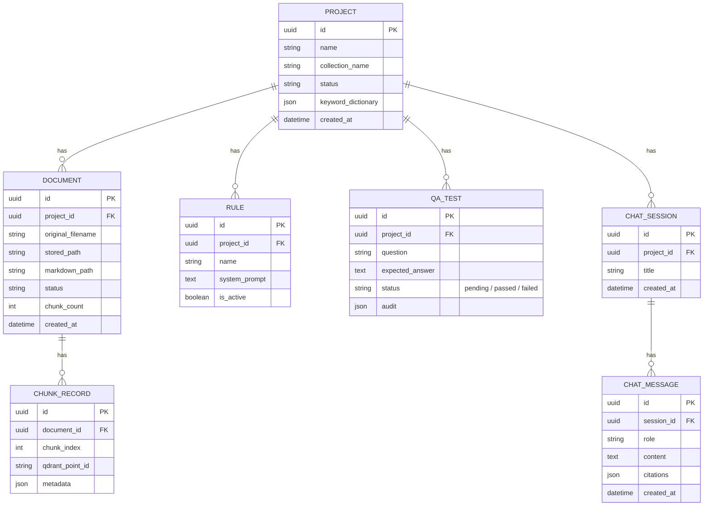
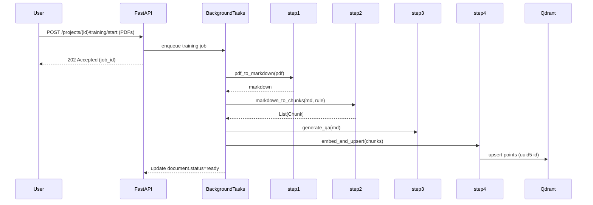
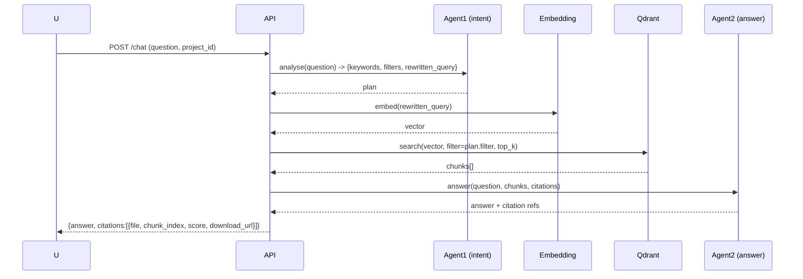

# Advanced RAG (Python Edition) — Software Design Document

**Version:** 0.1.0
**Date:** 2026-05-29
**Author:** Generated by GitHub Copilot
**Status:** Draft

---

## 1. 介紹

### 1.1 專案目的
本專案以 **TigerAI Advanced RAG Community**（Apache-2.0，基於 OpenGenie AI Stack）的架構為藍本，將其原本以 **n8n workflow + 多個 container** 組成的 RAG 系統，**全面 Python 化**：

- 後端：FastAPI（取代 n8n、tigerai-backend、tigerai-splitter）
- 前端：React + Vite + TypeScript（取代原 nginx + jQuery UI）
- 向量庫：Qdrant（沿用）
- 中繼資料庫：PostgreSQL（沿用；開發階段預設 SQLite）
- 文件解析：Docling（沿用；可 mock）
- LLM：OpenAI 相容 API（沿用；可 mock）

> **設計準則：** 保留原系統的「兩段式 Advanced RAG」與「四階段 Ingestion + QC」邏輯，並以 clean architecture 重組為單一 Python monorepo，方便部署、測試、擴充。

### 1.2 範圍
| 功能 | In scope | Out of scope |
|------|----------|--------------|
| PDF → Markdown | ✅ Docling Provider 抽象 | OCR 精度優化 |
| Markdown → JSON Chunks（含 L1/L2/L3 keywords） | ✅ LLM 解析 | 多模態圖表抽取 |
| QA / Quality Gate | ✅ 雙 AI 稽核 | 人工標註平台 |
| Ingestion → Qdrant | ✅ 含 UUIDv5 dedupe | 多 collection 跨庫聯邦 |
| 兩段式 RAG 查詢（Agent1 意圖 + Agent2 回答） | ✅ Streaming + Non-streaming | Re-ranking（付費版） |
| Rule Builder | ✅ 從樣本文件產生 system prompt | 多 prompt A/B 自動評分 |
| 引用來源下載 | ✅ | 簽章驗證 |
| QC 覆蓋率報表 | ✅ | Dashboards UI（用 chart lib） |
| 使用者與權限 | ❌（單一 admin token） | RBAC、SSO |
| 排程訓練 queue | ❌（用 BackgroundTasks） | Celery / Airflow |

### 1.3 名詞
- **Project**：一個知識庫專案，對應一個 Qdrant collection。
- **Rule**：解析特定領域文件的 system prompt。
- **Chunk**：Markdown 經 LLM 切出的有 metadata 的文字片段。
- **Point**：Qdrant 中一筆 vector + payload。
- **Pipeline Step**：原 n8n #01–#05 對應的 Python 服務模組。

---

## 2. 系統架構

### 2.1 整體高階圖



### 2.2 對應到原 TigerAI 架構

| 原系統元件 | 本專案實作 |
|------------|------------|
| nginx UI | `frontend/` (Vite dev server / 靜態 build) |
| tigerai-backend (Node) | `backend/app/api` |
| tigerai-splitter | `backend/app/services/splitter.py` |
| n8n #01 DataTransferring | `backend/app/pipelines/step1_pdf_to_md.py` |
| n8n #02 DataProcessing | `backend/app/pipelines/step2_md_to_json.py` |
| n8n #03 DataValidation | `backend/app/pipelines/step3_md_to_qa.py` |
| n8n #03b AIQualityGate | `backend/app/pipelines/step3b_quality_gate.py` |
| n8n #04 DataIngestion | `backend/app/pipelines/step4_ingestion.py` |
| n8n #05 RAG Core / Streaming | `backend/app/pipelines/step5_query.py` |
| Open WebUI Pipe | （前端聊天頁直接接 `/api/chat`） |
| FileBrowser | （前端 Files 頁，或直接 download API） |

### 2.3 後端分層

```
backend/app/
├── main.py              # FastAPI app factory
├── core/                # config, logging, security
│   ├── config.py        # Pydantic Settings
│   └── logging.py
├── db/                  # SQLAlchemy engine + session
│   ├── base.py
│   └── session.py
├── models/              # ORM
│   ├── project.py
│   ├── rule.py
│   ├── document.py
│   ├── qa_test.py
│   └── chat.py
├── schemas/             # Pydantic request/response
├── providers/           # 外部依賴抽象層 (可 mock)
│   ├── llm.py           # LLMProvider (Protocol)
│   ├── embedding.py     # EmbeddingProvider
│   ├── vector_store.py  # VectorStoreProvider (Qdrant)
│   └── docling.py       # DoclingProvider
├── pipelines/           # 核心業務流程
│   ├── step1_pdf_to_md.py
│   ├── step2_md_to_json.py
│   ├── step3_md_to_qa.py
│   ├── step3b_quality_gate.py
│   ├── step4_ingestion.py
│   └── step5_query.py
├── services/            # 應用服務
│   ├── splitter.py
│   ├── projects.py
│   ├── rules.py
│   ├── training.py      # orchestrate step1..step4
│   ├── chat.py          # wraps step5
│   └── qc.py
├── api/                 # FastAPI routers
│   ├── projects.py
│   ├── documents.py
│   ├── rules.py
│   ├── training.py
│   ├── chat.py
│   ├── qc.py
│   └── settings.py
└── workers/             # Background task runner
    └── runner.py
```

### 2.4 Provider Pattern

所有外部依賴透過 `Protocol` 介面定義，方便 swap：

```python
# providers/llm.py
class LLMProvider(Protocol):
    async def complete(self, *, system: str, user: str,
                       model: str | None = None,
                       temperature: float = 0.2) -> str: ...
    async def stream(self, ...) -> AsyncIterator[str]: ...
```

提供三種實作：
- `OpenAICompatibleLLM`：呼叫真實 API
- `MockLLM`：寫死回傳，給單元測試與 demo 用
- `EchoLLM`：把 prompt 回傳，給 debug

VectorStore 同理（`QdrantVectorStore` / `InMemoryVectorStore`），預設依 `settings.env` 切換。

---

## 3. 資料模型

### 3.1 關聯式表（PostgreSQL / SQLite）



### 3.2 Qdrant Payload Schema
與原系統對齊（每個 point）：
```json
{
  "text": "...",
  "original_file": "doc.pdf",
  "source_file": "doc.md",
  "chunk_index": 3,
  "project_name": "regulation_v1",
  "document_title": "...",
  "article_id": "第十一條",
  "section_id": "二",
  "tags": ["工時", "加班費"],
  "suggested_questions": ["..."],
  "l1": "勞動法規",
  "l2": "工時",
  "l3": "加班費"
}
```
**Point ID = `uuid5(NAMESPACE_URL, f"{original_file}#{chunk_index}")`**（與原系統一致，重跑時 overwrite）。

---

## 4. 核心流程設計

### 4.1 Training Pipeline（Ingestion）



> Background task 用 FastAPI `BackgroundTasks` + `asyncio.Queue`（單機）。  
> 之後若要擴展為分散式，介面已抽到 `workers/runner.py`，可改 Celery / Arq。

### 4.2 Advanced RAG Query



支援兩種模式：
- **Non-streaming**：`POST /api/chat`
- **Streaming**：`POST /api/chat/stream` (SSE `text/event-stream`)

### 4.3 Rule Builder
1. 使用者上傳 1–3 份代表性樣本（PDF）。
2. step1 轉成 Markdown。
3. 呼叫 LLM：給 markdown 範例 → 產 3 個候選 system prompt（A/B/C）。
4. 使用者選定 → 寫入 `rule.system_prompt`，`is_active=true`。
5. 之後 step2 解析時帶這個 prompt。

### 4.4 QC（三層）
1. **QA test (step3)**：每份文件產 10 題（pending）。
2. **Coverage check**：比對 `DOCUMENT.chunk_count` vs Qdrant `count(payload.project_name=...)`，產覆蓋率報表。
3. **Answer audit (step3b)**：對 QA 題跑 RAG，再請 Judge LLM 評分（passed/failed + reason）。

---

## 5. API 規格（節錄）

| Method | Path | 說明 |
|--------|------|------|
| POST | `/api/projects` | 建立專案 |
| GET | `/api/projects` | 列表 |
| GET | `/api/projects/{id}` | 詳情 |
| POST | `/api/projects/{id}/rule/build` | Rule Builder：給樣本→產 prompts |
| POST | `/api/projects/{id}/rule` | 設定 active rule |
| POST | `/api/projects/{id}/documents` | 上傳 PDF（multipart） |
| GET | `/api/projects/{id}/documents` | 列表 |
| POST | `/api/projects/{id}/training/start` | 啟動 ingestion |
| GET | `/api/projects/{id}/training/status` | 任務狀態 |
| POST | `/api/chat` | RAG 問答（non-stream） |
| POST | `/api/chat/stream` | RAG 問答（SSE） |
| GET | `/api/projects/{id}/qc/coverage` | 覆蓋率 |
| POST | `/api/projects/{id}/qc/audit` | 跑 answer audit |
| GET | `/api/files/{doc_id}/download` | 下載原始檔 |
| GET | `/api/settings` / PUT | 系統設定 |
| GET | `/api/health` | 健康檢查 |

詳細 JSON schema 由 FastAPI auto-generated `/docs` (OpenAPI) 提供。

---

## 6. 設定與部署

### 6.1 環境變數（`.env`）
```
APP_ENV=dev
DATABASE_URL=sqlite+aiosqlite:///./data/app.db
QDRANT_URL=http://localhost:6333
QDRANT_API_KEY=
LLM_PROVIDER=openai           # openai | mock
LLM_BASE_URL=https://api.openai.com/v1
LLM_API_KEY=
LLM_MODEL=gpt-4o-mini
EMBEDDING_MODEL=text-embedding-3-small
EMBEDDING_DIM=1536
DOCLING_PROVIDER=local        # local | mock | http
DOCLING_HTTP_URL=
DATA_DIR=./data
ADMIN_TOKEN=change-me
```

### 6.2 Docker Compose
```
services:
  qdrant      :  qdrant/qdrant:latest
  postgres    :  postgres:17
  backend     :  build ./backend          depends_on: [qdrant, postgres]
  frontend    :  build ./frontend         depends_on: [backend]
```
（開發階段可用 `make dev`：SQLite + 本機 Qdrant container）

---

## 7. 測試策略

| 層級 | 工具 | 涵蓋 |
|------|------|------|
| Unit | pytest + pytest-asyncio | providers (mock), pipelines (mock LLM/VS), utils |
| API | httpx AsyncClient + FastAPI TestClient | 每條 route 的 happy + error path |
| Integration | pytest + InMemoryVectorStore + MockLLM | 完整 step1→step5 流程 |
| E2E | docker-compose + scripts/e2e_smoke.py | 上傳 → train → chat → QC |

CI 目標：`pytest -q` 全綠、覆蓋率 ≥ 80% (核心 pipelines / providers)。

---

## 8. 安全性（OWASP）
- **A01 Access Control**：所有 `/api/*` 寫入端點需 `X-Admin-Token`（MVP）；後續可換 OAuth。
- **A03 Injection**：SQL 全走 SQLAlchemy ORM；LLM prompt 注入透過 system prompt 隔離 + 將使用者輸入包覆於 `<user_query>` tag。
- **A05 Misconfig**：CORS allow_origins 由 env 控制；prod 不允許 `*`。
- **A08 Software/Data Integrity**：檔案上傳限制副檔名與大小，路徑安全用 `pathlib.Path.resolve()` + `is_relative_to`。
- **A09 Logging**：結構化 log（JSON）、記錄 request_id；不記錄 prompt 內容於 INFO 等級。

---

## 9. 與原系統的差異與權衡

| 項目 | TigerAI 原系統 | 本實作 | 理由 |
|------|----------------|--------|------|
| Workflow 引擎 | n8n | Python services | 減少跨進程開銷、易於測試 / debug |
| Backend | Node | FastAPI (Python) | 單一語言、async 原生、與 LLM 生態相容 |
| Splitter | 獨立 container | 同 backend 內模組 | 降部署複雜度（單檔案上傳場景） |
| Open WebUI Pipe | n8n function | 直接走 `/api/chat/stream` | 不需額外 Pipe 安裝 |
| 監控 | Grafana/Prom | Prometheus middleware + `/metrics`（option） | MVP 簡化 |
| Cloud-only | ✅ | 預設 Cloud；介面層保留 local provider 換手 | 未來可串 Ollama / vLLM |

---

## 10. 風險與未來工作
- **LLM 成本控管**：尚未實作 token 預算；TODO `services/budget.py`。
- **大檔案處理**：超大 PDF (>200MB) 需 streaming 切檔；splitter 之後加 PyMuPDF。
- **Re-ranking / KG**：留 `providers/reranker.py` 介面，付費版可掛 Cohere/bge-reranker。
- **多租戶 / RBAC**：MVP 單 admin token，正式上線需 Auth。

— end of SDD —
